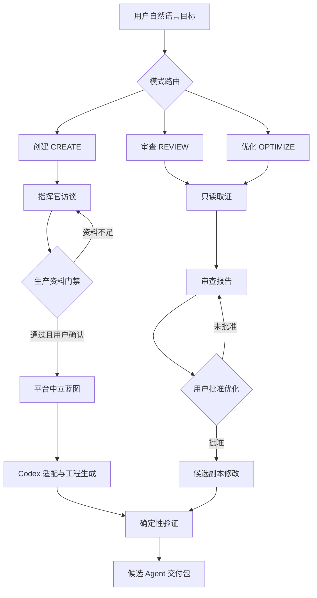

# Commander’s Intent Agent Factory V0.1 Design

**日期：** 2026-07-11  
**状态：** 对话设计已确认，书面规格待用户复核  
**公开仓库：** `zhaobo258-netizen/Commander-s-Intent-Agent`  
**许可证：** MIT

## 1. 产品定义

Commander’s Intent Agent Factory（指挥官意图 Agent 工厂）是一套本地优先、可开源复用的 Agent 生产与治理系统。它把用户的模糊目标转换成经过访谈确认的指挥官意图、平台中立的 Agent 蓝图、可运行的 Codex Agent，以及可复核的测试和证据。

工厂不是普通 Prompt 集合，也不是替用户直接完成业务任务的万能 Agent。它是制造、审查和优化其他 Agent 的元 Agent 与确定性工具组合。

### 1.1 一句话目标

让没有工程背景的用户只需用日常语言说明目标，工厂就能通过一次一个问题的访谈补齐生产资料，并在满足门禁后生成、审查或优化一个可验证的 Agent。

### 1.2 已确认的产品决策

1. 本地项目文件夹是唯一真相源，同时提供可选的全局 Codex Skill 入口。
2. 核心协议保持平台中立，V0.1 只交付完整可运行的 Codex 适配器。
3. 使用形态是“自然语言元 Agent + 确定性脚本”，V0.1 不开发 Web 界面。
4. 公开仓库采用 MIT 许可证。
5. 文档以中文为主，同时提供英文 README 和核心使用说明。
6. 私人访谈资料和未完成 Agent 默认不进入公开 Git 仓库。

## 2. 用户与核心场景

### 2.1 目标用户

- 希望把业务目标变成 Agent、但不熟悉 Agent 工程的业务负责人。
- 需要稳定生产业务 Agent 的产品经理、顾问和开发者。
- 希望审查现有 Agent 是否目标清楚、能力完整、边界可靠的团队。
- 希望基于开源模板贡献新适配器、规则或示例的社区开发者。

### 2.2 三种正式工作模式

#### 创建模式 `CREATE`

用户描述想实现的目标。工厂识别缺失信息，一次只问一个问题，形成经用户确认的指挥官意图，通过生产门禁后生成平台中立蓝图和 Codex 交付包。

#### 审查模式 `REVIEW`

用户提供一个现有 Agent 文件夹。工厂默认只读，基于文件与运行证据输出逐项审查报告，不自动修改目标 Agent。

#### 优化模式 `OPTIMIZE`

工厂先按审查模式取证，再提出优化计划。用户明确批准后，工厂在候选副本中修改并运行回归验证；默认不覆盖原 Agent。

模式路由采用以下确定规则：用户只描述新目标时进入 `CREATE`；用户提供现有 Agent 并要求评价、检查或打分时进入 `REVIEW`；用户提供现有 Agent 并要求改进、修复或升级时进入 `OPTIMIZE`。请求同时包含审查和修改时，必须先完成只读审查，再进入优化授权门禁。

### 2.3 代表性触发语句

- “我想做一个帮助区域经理发现销售机会的 Agent。”
- “审查 `/path/to/agent`，告诉我它是否真的能完成目标。”
- “基于审查结果优化这个 Agent，但不要直接覆盖原文件。”
- “继续上次没有完成的 Agent 生产单。”
- “把工厂的 Codex Skill 安装到全局，但保留仓库为真相源。”

## 3. 范围与非目标

### 3.1 V0.1 范围

- 指挥官访谈、信息溯源和生产准备度门禁。
- 平台中立的指挥官意图与 Agent 蓝图协议。
- Codex 元 Agent、Codex Skill 适配器和可选全局安装。
- 标准 Agent 工程目录生成。
- 现有 Agent 的只读审查。
- 经过授权的候选副本优化。
- Schema、状态机、门禁、模板和端到端案例验证。
- 中英文公共入口文档、贡献说明和 MIT 许可证。

### 3.2 V0.1 非目标

- Web 管理后台、账号系统或云端数据库。
- 在线运行或托管用户生产出的业务 Agent。
- 同时交付 Claude Code、OpenClaw 或 WorkBuddy 的完整适配器。
- 自动部署生成的 Agent 到生产环境。
- 在线 Skill 市场、计费或多租户能力。
- 仅凭静态文件宣称业务结果或真实使用已经验证。

## 4. 总体架构



### 4.1 组件边界

| 组件 | 职责 | 不负责 |
|---|---|---|
| 项目入口 `AGENTS.md` | 识别工厂身份、模式和真相源 | 承载全部详细规则 |
| Codex Skill | 对话编排、访谈、判断和资源路由 | 重复定义核心 Schema |
| Contracts | 定义意图、蓝图、任务和报告的数据契约 | 业务判断 |
| Governance | 定义门禁、状态转换、评分和证据规则 | 生成业务内容 |
| CLI | 建生产单、校验、生成、审查、安装和报告 | 自行猜测缺失业务事实 |
| Templates | 提供标准 Agent 文件结构 | 决定哪些能力必须存在 |
| Workshop | 保存私人生产单、检查点和候选产物 | 默认公开发布 |
| Examples | 保存脱敏且通过验证的公开示例 | 保存客户原始资料 |

## 5. 仓库结构

```text
Commander-s-Intent-Agent/
├── AGENTS.md
├── README.md
├── README_EN.md
├── LICENSE
├── CONTRIBUTING.md
├── SECURITY.md
├── pyproject.toml
│
├── factory/
│   ├── contracts/
│   │   ├── commander-intent.schema.json
│   │   ├── agent-blueprint.schema.json
│   │   ├── factory-job.schema.json
│   │   └── review-report.schema.json
│   ├── governance/
│   │   ├── production-gates.yaml
│   │   ├── state-machine.yaml
│   │   ├── evaluation-policy.yaml
│   │   └── evidence-policy.md
│   ├── interview/
│   ├── production/
│   ├── review/
│   └── cli/
│
├── skills/
│   └── commander-agent-factory/
│       ├── SKILL.md
│       ├── agents/
│       │   └── openai.yaml
│       └── references/
│
├── templates/
│   ├── job/
│   └── agent/
├── examples/
├── tests/
├── docs/
├── scripts/
└── workshop/
    ├── README.md
    ├── jobs/       # 默认 Git 忽略
    └── reviews/    # 默认 Git 忽略
```

`factory/contracts/` 和 `factory/governance/` 是机器可读规则的真相源。Codex Skill 只引用这些规则，不复制一份容易漂移的平行定义。

### 5.1 私人生产单结构

```text
workshop/jobs/<日期>-<agent名称>/
├── JOB.md
├── intake/
├── COMMANDER_INTENT.md
├── intent.yaml
├── blueprint.yaml
├── status.json
├── evidence/
├── reports/
└── output/
```

审查任务使用同样的生产单协议，但默认写入 `workshop/reviews/<日期>-<目标名称>/`。审查证据和报告不得写入被审 Agent；只有用户明确进入优化模式并批准计划后，工厂才能创建可修改的候选副本。

## 6. 核心数据契约

所有机器可读数据必须符合 JSON 兼容的数据模型。用户友好的意图和蓝图使用 YAML；状态、Manifest 和结构化报告使用 JSON。两者都由 JSON Schema 校验。

### 6.1 Factory Job

每次创建、审查或优化都必须有独立生产单，至少记录：

- 唯一任务 ID、名称、模式和目标路径。
- 当前状态、允许的下一状态和最后检查点。
- 用户原始输入、已确认事实、推断和未解决问题。
- 作用范围、禁止事项和外部写入授权。
- 已运行的验证、退出码、证据路径和未验证项。
- `local_generated`、`local_validated`、`installed`、`published`、`real_usage_verified` 分层状态。

### 6.2 Commander Intent

指挥官意图至少包含：

- 使命、服务对象和使用场景。
- 当前状态 `before` 与目标状态 `after`。
- 关键任务及任务结果。
- 成功指标、观测方法和验收标准。
- 数据、知识、工具和可用资源。
- 允许事项、禁止事项和人工确认节点。
- 已知风险、假设与仍未确认的内容。
- 每个关键事实的来源和确认状态。

来源类型固定为：

- `user_confirmed`：用户明确确认。
- `observed_file`：从指定文件读取并有路径证据。
- `tool_result`：由工具运行得到并保留结果证据。
- `inference`：基于证据推断但未经用户确认。
- `assumption`：暂时假设，不能满足关键准入门禁。

### 6.3 Agent Blueprint

平台中立蓝图至少描述：

- Agent 元数据与版本。
- 指挥官意图引用与可追溯关系。
- 能力、Skill、输入、输出与依赖。
- 工作流、分支、人工审核点和降级路径。
- 工具权限、数据来源和知识边界。
- 状态、记忆、错误处理和恢复策略。
- 评估案例、质量指标与运行环境要求。
- 平台适配器列表及其成熟度状态。

### 6.4 Review Report

审查报告至少包含：

- 被审对象、基线、范围和审查时间。
- 可读取与不可读取的证据范围。
- 分项发现、严重程度、文件与行号证据。
- 对指挥官意图的影响和建议动作。
- 已验证、推断、未验证和阻塞项。
- 质量评价、部署边界与最终结论。

## 7. 指挥官访谈

### 7.1 问询规则

1. 一次只问一个问题。
2. 优先询问会阻断生产或带来高风险的缺失项。
3. 使用非技术人员能理解的语言。
4. 每个问题说明“为什么需要回答”。
5. 提供推荐答案或默认方向，并说明理由。
6. 提供其他明确选项，同时允许回答“暂时不知道”。
7. 每个回答立即写入生产单检查点。
8. 推断和假设必须显式标记，不得伪装成用户确认。

### 7.2 问题优先级

问题按以下顺序选择最高风险的一个：

1. 为谁服务、在哪个场景使用。
2. 想改变什么现实结果。
3. 什么证据代表成功。
4. Agent 必须完成哪些关键任务。
5. 可使用哪些真实数据、知识和工具。
6. 哪些动作允许自动完成，哪些必须人工确认。
7. 如何测试和验收。

## 8. 生产准入门禁

### 8.1 准备度评分

| 检查项 | 分值 |
|---|---:|
| 使命与业务问题 | 15 |
| 服务对象与使用场景 | 15 |
| 目标状态与成功证据 | 20 |
| 关键任务 | 10 |
| 数据、知识和工具来源 | 15 |
| 权限、禁区和人工确认点 | 15 |
| 验收与测试方法 | 10 |

允许进入生产必须同时满足：

- 总分不低于 80。
- 不存在关键未知项。
- 用户明确确认当前版本的指挥官意图。
- 所有关键事实具有可识别来源。

### 8.2 不可被总分抵消的关键阻塞项

以下任一情况存在时，无论总分多少都禁止生产：

- 不知道具体服务对象或使用场景。
- 不知道 Agent 要改变的现实结果。
- 分析型 Agent 没有真实数据或知识来源。
- 执行型 Agent 没有权限边界和人工确认要求。
- 高风险动作没有失败、回滚或降级策略。
- 不知道如何验收 Agent 是否完成目标。

## 9. 状态机与恢复

### 9.1 创建流程

```text
NEW
→ DISCOVERY
→ INTERVIEWING
→ INTENT_CONFIRMATION
→ READY
→ BLUEPRINTING
→ PRODUCING
→ VALIDATING
→ CANDIDATE_READY
→ DELIVERED
```

### 9.2 审查与优化流程

```text
NEW
→ REVIEW_INTAKE
→ REVIEWING
→ REVIEW_READY
→ OPTIMIZATION_PROPOSED
→ OPTIMIZATION_APPROVED
→ OPTIMIZING
→ VALIDATING
→ CANDIDATE_READY
```

`BLOCKED` 和 `CANCELLED` 是显式终止或暂停状态。每次状态转换必须记录触发条件、验证证据和恢复入口。会话恢复时必须先读取生产单，再现场验证可能漂移的外部状态。

## 10. Agent 生产输出

一个标准候选 Agent 至少包含：

```text
Agent-Name/
├── README.md
├── COMMANDER_INTENT.md
├── AGENT_SPEC.yaml
├── ARCHITECTURE.md
├── WORKFLOW.md
├── factory-manifest.json
├── skills/
├── prompts/
├── tools/
├── knowledge/
├── evaluation/
├── deployment/
└── adapters/
    └── codex/
        ├── SKILL.md
        └── agents/
            └── openai.yaml
```

只有实际需要的可选目录才会生成。`factory-manifest.json` 必须解释哪些组件存在、哪些不适用、生成来源和验证状态，避免空目录伪装成完整能力。

### 10.1 Codex 适配器

- 遵循 Codex Skill 的命名、Frontmatter、渐进式加载和验证规则。
- Skill 目录只保留运行所需文件，不放重复 README 或过程文档。
- 项目内 Skill 是受版本控制的真相源。
- 全局安装是显式、可撤销的操作，支持复制或符号链接模式。
- 安装后必须检查全局入口与仓库版本是否一致；安装成功不等于业务 Agent 已验证。

## 11. 审查系统

### 11.1 审查维度

1. 指挥官意图是否明确。
2. 目标、任务、能力和验证是否可追溯。
3. Skill 是否缺失、重复或过度拆分。
4. 数据和知识是否有真实来源与边界。
5. 工具权限是否最小化且与目标一致。
6. 状态、错误、恢复和降级机制是否完整。
7. 人工审核点是否覆盖高风险动作。
8. 测试是否覆盖正常、失败、边界和未知情况。
9. 非技术用户是否能理解和使用。
10. 是否存在隐私、安全、许可证或平台耦合风险。

### 11.2 发现格式

每条发现必须包含：

- `P0` 至 `P3` 严重程度。
- 紧凑的文件与行号范围或运行证据。
- 对目标或安全边界的实际影响。
- 可以执行的修改建议。
- `verified`、`inferred` 或 `unverified` 证据状态。

严重程度定义：

- `P0`：可能造成严重安全、数据或不可逆业务损害，必须阻止使用。
- `P1`：核心目标无法可靠完成或存在重大越权风险。
- `P2`：重要能力、可靠性或可维护性缺陷。
- `P3`：不阻断使用的清晰度、一致性或体验改进。

### 11.3 五层质量模型

- Intent：20 分。
- Capability：20 分。
- Execution：20 分。
- Outcome：30 分。
- Evolution：10 分。

只有存在匹配证据的层级才能形成确认分数。缺少真实业务结果时，Outcome 与 Evolution 必须标记为 `not_evidenced`，总评只能是“临时评价”，不能给出 S/A 级生产结论。

## 12. 优化系统

默认优化流程：

```text
只读审查
→ 问题清单
→ 优化计划
→ 用户明确批准
→ 创建候选副本与恢复点
→ 修改候选副本
→ 回归验证
→ 前后差异报告
→ 用户决定是否替换原版本
```

没有明确批准时，工厂不得修改被审 Agent。即使用户要求原地修改，也必须先记录基线和恢复点。优化不得悄悄改变原始使命；使命变化必须形成新版本的指挥官意图并再次确认。

## 13. 错误、边界与降级

| 情况 | 行为 |
|---|---|
| 资料不足 | 回到访谈，不生成候选 Agent |
| 用户回答冲突 | 输出一张人话决策卡，请用户选择 |
| Schema 校验失败 | 保持当前状态，报告精确字段和修正建议 |
| 工具或测试失败 | 保存退出码和日志，不写成通过 |
| 被审 Agent 无法完整读取 | 输出限定范围结论和未覆盖清单 |
| 高风险自动操作 | 降级为人工确认模式 |
| 外部状态可能漂移 | 恢复任务时重新现场读取 |
| 用户要求超出授权范围 | 停止对应动作并请求新授权 |

## 14. 隐私与开源边界

- `workshop/jobs/` 和 `workshop/reviews/` 默认由 Git 忽略。
- 生产单不得保存明文密钥、Token、验证码或客户敏感原文；只记录安全路径、键名和证据摘要。
- CLI 默认不访问网络，不自动安装、不自动发布、不自动部署。
- 任何进入 `examples/` 的内容必须经过敏感信息扫描和人工公开确认。
- 生成 Agent 的许可证由用户选择；工厂自身代码和模板采用 MIT。
- 安全问题通过 `SECURITY.md` 提供非公开报告方式。

## 15. 技术方案

- Python 3.11 或更高版本。
- 标准库 `argparse` 作为 CLI 基础，减少运行依赖。
- YAML 用于人类可读配置，JSON Schema 用于机器校验。
- `PyYAML` 和 `jsonschema` 为运行依赖，`pytest` 为开发依赖。
- `pyproject.toml` 定义包、命令入口和依赖。
- GitHub Actions 在 Push 和 Pull Request 上运行完整本地门禁。
- 默认不依赖云服务或特定模型 API。

### 15.1 V0.1 CLI 边界

CLI 至少支持：

- 创建或恢复生产单。
- 显示当前状态、缺失项和下一步。
- 校验指挥官意图、蓝图和审查报告。
- 在门禁通过后生成候选 Agent 目录。
- 对指定 Agent 执行只读结构审查。
- 为优化创建候选副本和差异报告。
- 验证整个仓库和公开示例。
- 安装、检查和卸载全局 Codex Skill 入口。

## 16. 测试与质量门禁

### 16.1 自动测试层级

1. **Schema 单元测试**：合法样例通过，缺失、类型错误和未知关键字段失败。
2. **门禁单元测试**：分数、关键阻塞项和来源规则正确。
3. **状态机测试**：合法转换通过，越级转换失败，检查点可恢复。
4. **模板测试**：生成目录与 Manifest 一致，不产生无意义空组件。
5. **创建集成测试**：完整意图能生成候选 Agent；不完整意图保持阻塞。
6. **审查集成测试**：审查不修改目标，发现包含可定位证据。
7. **优化集成测试**：未批准不修改；批准后只修改候选副本。
8. **Codex Skill 验证**：结构、Frontmatter 和 UI 元数据通过官方校验。
9. **隐私测试**：示例和待提交内容不包含常见密钥或私人生产单。
10. **端到端示例**：覆盖 Golden、Failure、Boundary 和 Unknown 四类案例。

### 16.2 完成状态分层

每次报告必须区分：

- `local_generated`：本地产物已生成。
- `local_validated`：指定本地门禁已通过。
- `installed`：Codex 入口已安装并核对版本。
- `published`：提交已推送到公开仓库并核对远端提交。
- `real_usage_verified`：真实用户或真实业务场景已运行并有证据。
- `unverified`：没有匹配证据的状态。

前一层成立不能自动推出后一层成立。

## 17. 公共仓库交付

公开仓库必须提供：

- 中文 README：定位、三种模式、快速开始、隐私边界和状态解释。
- 英文 README：产品定位、安装、核心流程和贡献入口。
- MIT LICENSE。
- CONTRIBUTING：开发环境、测试、分支和 PR 规则。
- SECURITY：安全问题报告边界。
- 至少一个完整的脱敏创建示例和一个审查示例。
- GitHub Actions 质量门禁。

V0.1 首次公开发布只有在本地门禁和远端 CI 都通过后才可标记。公开发布不代表生成的业务 Agent 已在真实环境使用。

## 18. 实施里程碑

### M0：规格与仓库基线

完成书面设计、实施计划、Git 基线和公开仓库关联。

### M1：合同与确定性核心

实现数据 Schema、门禁、状态机、生产单和仓库验证命令。

### M2：创建流水线与 Codex 适配

实现访谈协议、标准模板、候选 Agent 生成和 Codex Skill 安装验证。

### M3：审查与优化流水线

实现只读审查、证据化报告、候选副本优化和前后差异验证。

### M4：公共交付

完成中英文文档、脱敏示例、CI、许可证、贡献说明和远端发布验证。

## 19. V0.1 验收标准

V0.1 必须同时满足：

1. 用户能在项目内用自然语言触发创建、审查和优化三种模式。
2. 创建模式一次只问一个问题，并在资料不足时保持阻塞。
3. 完整意图能够生成符合标准结构的平台中立蓝图和 Codex 候选 Agent。
4. 审查模式不修改目标 Agent，并输出带证据的逐项发现。
5. 优化模式未经批准不修改；批准后默认只修改候选副本。
6. 生产单可在会话中断后恢复，且不会把旧外部状态当成当前事实。
7. 所有机器可读产物通过 Schema 校验。
8. 自动测试覆盖正常、失败、边界和未知案例。
9. 私人 Workshop 内容默认不会被 Git 提交。
10. 项目内 Skill 与可选全局入口之间可以检查版本漂移。
11. 中英文公共入口、MIT 许可证、贡献与安全说明齐全。
12. 本地、安装、发布和真实使用状态在报告中明确分层。

## 20. 设计原则总结

- 使命先于能力，结果先于功能。
- 约束先于自动化，证据先于结论。
- 资料不足时继续访谈，不用假设填空。
- AI 负责语义判断，脚本负责可重复验证。
- 创建、审查和优化是不同权限模式。
- 仓库是真相源，全局安装只是可撤销入口。
- 静态完整不等于真实有效，本地通过不等于远端或实际使用。
